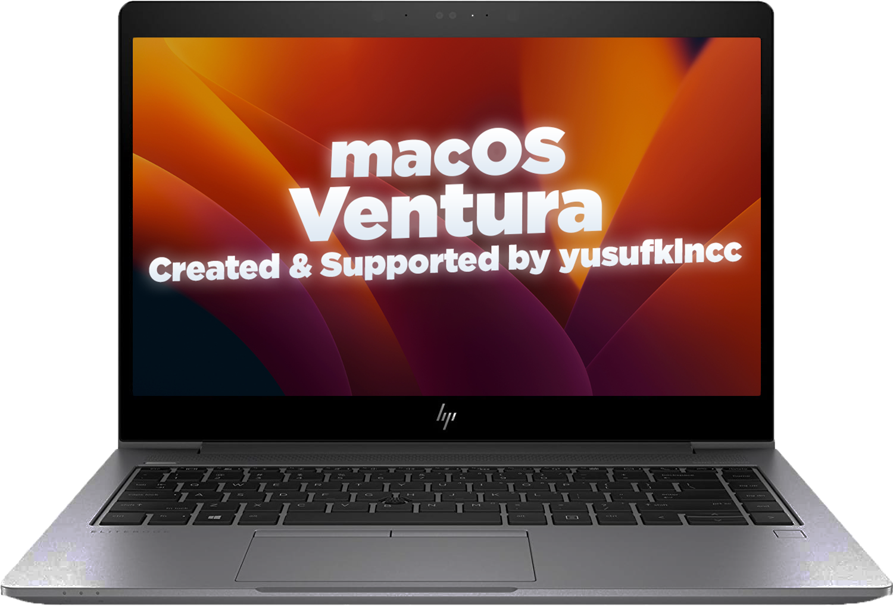

<h1 align="center"> macOS Tahoe on HP EliteBook 840 G5 </h1>

  

<h4 align="center"> OpenCore EFI for Hackintosh HP EliteBook 840 G5 </h4>

Created & supported by jellobo

  
  
  

## What works

- CPU: Intel i5-7300U (2 cores / 4 threads, native PM)
- Graphics: Intel UHD 620 (full acceleration, HDMI mirror)
- Thunderbolt 3: 10 Gbps sustained
- Audio: AppleALC (alcid=3), internal + headset
- Wi-Fi / Bluetooth: Intel 8265 (AirportItlwm + IntelBluetoothFirmware)
- Sleep / Wake: Deep sleep reliable
- USB: USB 3.0 mapped
- NVMe SSD: CT2000P3PSSD8 (NVMeFix for APST)
- Battery / Charging: SMCBatteryManager
- Keyboard / Trackpad: VoodooPS2 + VoodooI2C, gestures work
- Ethernet: Intel I219-LM (IntelMausi.kext — standard version without VT-d/IOMMU support; VT-d aware version disabled, not stable on Tahoe)

## What's included

- `EFI-PAGE.html` — full visual documentation
- `EFI-CLEAN/` — clean OpenCore folder with placeholders (MLB, ROM, Serial, UUID must be filled)
- `OC/config.plist` — cleaned (placeholders for sensitive identifiers)

## References

Based on open-source work by yusufklncc, kmasterycsl, timbachmann, tblesshack (see [`references`](#)).
